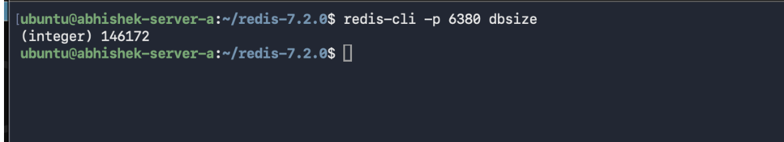
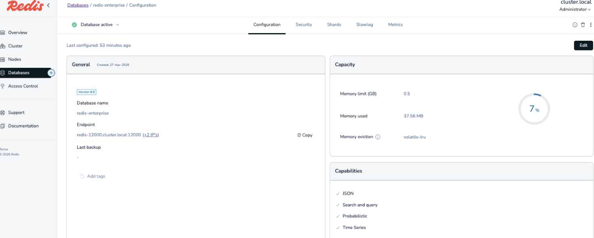
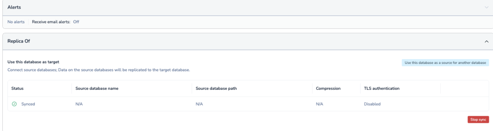
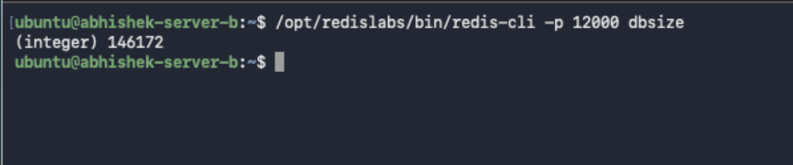

# Part 1 - Redis Setup and Replication

This README documents the Redis OSS to Redis Enterprise replication setup.

Docker was not used for this implementation.

## Environment

| Item | Value |
|---|---|
| Redis OSS Server A | `34.93.131.87` |
| Redis Enterprise Server B | `35.200.229.232` |
| Redis OSS Version | `7.2.0` |
| Redis OSS Port | `6380` |
| Redis Enterprise Database | `redis-enterprise` |
| Redis Enterprise Database Port | `12000` |
| Redis Enterprise Endpoint | `redis-12000.cluster.local:12000` |

## 1. Redis OSS Setup on Server A

Redis OSS `7.2.0` was installed on Server A without Docker.

Redis version snapshot:


## 2. Redis OSS Configuration

The default Redis port `6379` was changed to `6380`.

Persistence was enabled using AOF with `appendfsync always` for the best durability guarantees.

redis.conf file path:


[redis conf](redis.conf)


Key configuration:

```conf
port 6380
bind 0.0.0.0
daemonize yes
protected-mode no
logfile /var/log/redis/redis.log
dir /var/lib/redis

appendonly yes
appendfsync always

save ""
```

## 3. Data Load Using memtier-benchmark

Data was loaded into Redis OSS using `memtier-benchmark`.

Command used on Server A:

```bash
memtier_benchmark \
  --server=127.0.0.1 \
  --port=6380 \
  --protocol=redis \
  --clients=50 \
  --threads=4 \
  --requests=200000 \
  --data-size=100 \
  --ratio=1:0 \
  --pipeline=10 \
  --key-minimum=1 \
  --key-maximum=300000
```

The same command is also saved here:


[memtier_benchmark_command](memtier_benchmark_command.txt)

Throughput and latency output file:


[memtier_throughput&latency](memtier_throughput&latency.txt)

Note: add the captured `memtier-benchmark` throughput and latency summary to this file before final submission.

Redis OSS key count:

```bash
~/redis-7.2.0/src/redis-cli -p 6380 dbsize
```

Output:

```text
146172
```

Snapshot:



## 4. Redis Enterprise Setup on Server B

Redis Enterprise was installed on Server B using the no-DNS setup.

A database named `redis-enterprise` was created to receive replication from Redis OSS.

## 5. Redis Enterprise Database Configuration

| Field | Value |
|---|---|
| Database Name | `redis-enterprise` |
| Endpoint | `redis-12000.cluster.local:12000` |
| Port | `12000` |
| Memory Limit | `0.5 GB` |
| Eviction Policy | `volatile-lru` |
| Replication Source | `redis://34.93.131.87:6380/` |

Database configuration snapshot:



## 6. Replication Status

Replication was configured from Redis OSS to Redis Enterprise.

Replication direction:

```text
Redis OSS Server A  ->  Redis Enterprise Server B
34.93.131.87:6380  ->  redis-12000.cluster.local:12000
```

Redis Enterprise replication status snapshot:



## 7. Key Count Validation

The key count on Redis OSS and Redis Enterprise matched after replication.

| Database | Key Count | Snapshot |
|---|---:|---|
| Redis OSS Source | `146172` |  |
| Redis Enterprise Target | `146172` |  |

Result:

```text
PASS - Key counts match.
```

## 8. Issue Faced and Resolution

### Connection Error

Problem:

```text
Redis Enterprise was not able to connect to Redis OSS on Server A.
```

Root cause:

```text
The source URL format was not correct.
```

Connectivity test from Server B:

```bash
nc -vz 34.93.131.87 6380
```

Output:

```text
Connection to 34.93.131.87 6380 port [tcp/*] succeeded!
```

Resolution:

```text
The source URL was corrected to redis://34.93.131.87:6380/.
```

Snapshot:


## Submission Checklist

- Redis OSS `7.2.0` installed on Server A.
- Docker was not used.
- Default port `6379` changed to `6380`.
- AOF persistence enabled with `appendfsync always`.
- `redis.conf` path and snippet included.
- `memtier-benchmark` command included.
- Throughput and latency output location included.
- Redis Enterprise installed on Server B using no-DNS setup.
- Redis Enterprise database configuration snapshot included.
- Redis Enterprise replication status snapshot included.
- Redis OSS and Redis Enterprise key counts match.
