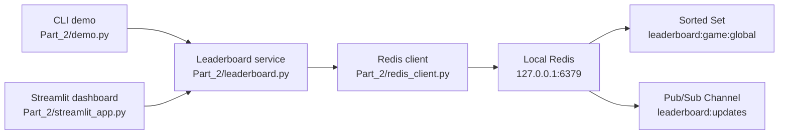

# Part 2 - Real-Time Redis Leaderboard

This demo implements a real-time gaming leaderboard using local Redis. Player scores are stored in a Redis sorted set, which keeps rankings updated as scores change.

## Architecture Diagram



## Assumptions and Scale Targets

Assumptions:

- Redis runs locally on `127.0.0.1:6379`.
- The demo uses one global leaderboard.
- Player IDs are generated as `player:0001`, `player:0002`, and so on.
- Scores are numeric values.
- Redis is the live ranking store for this demo.
- Long-term score history is outside the scope of this implementation.

Scale targets:

| Target | Value |
|---|---:|
| Simulated players | `1,000` by default |
| Supported Top-N lookup in UI | Up to `10,000` |
| Default score updates per refresh | `25` |
| Max score updates per refresh in UI | `1,000,000` |
| Main write commands | `ZADD`, `ZINCRBY` |
| Main read commands | `ZREVRANGE`, `ZREVRANK`, `ZSCORE` |

## Data Model and Example Commands

Primary Redis key:

```text
leaderboard:game:global
```

Redis type:

```text
Sorted Set / ZSET
```

Data format:

```text
member = player id, for example player:0042
score  = numeric game score
```

Commands used by the application:

| Requirement | Redis command | Purpose |
|---|---|---|
| Add or update score | `ZADD leaderboard:game:global <score> <playerId>` | Adds a player or replaces the player's score |
| Increment score | `ZINCRBY leaderboard:game:global <delta> <playerId>` | Adds points to an existing player score |
| Retrieve Top-N players | `ZREVRANGE leaderboard:game:global 0 <N-1> WITHSCORES` | Reads the highest scoring players |
| Retrieve player rank | `ZREVRANK leaderboard:game:global <playerId>` | Gets zero-based rank from highest score |
| Retrieve player score | `ZSCORE leaderboard:game:global <playerId>` | Gets the player's current score |
| Count players | `ZCARD leaderboard:game:global` | Counts leaderboard members |
| Publish update event | `PUBLISH leaderboard:updates <json>` | Broadcasts score update events |

Manual examples:

```bash
redis-cli -h 127.0.0.1 -p 6379 ZADD leaderboard:game:global 85000 player:0001
redis-cli -h 127.0.0.1 -p 6379 ZINCRBY leaderboard:game:global 500 player:0001
redis-cli -h 127.0.0.1 -p 6379 ZREVRANGE leaderboard:game:global 0 9 WITHSCORES
redis-cli -h 127.0.0.1 -p 6379 ZREVRANK leaderboard:game:global player:0001
redis-cli -h 127.0.0.1 -p 6379 ZSCORE leaderboard:game:global player:0001
```

## Redis Value, Alternatives, and Tradeoffs

Redis value for this solution:

- Sorted sets keep rankings updated automatically as scores change.
- Top-N reads are a single Redis command.
- Score updates are atomic.
- Rank lookup and score lookup use the same live data source.
- Redis keeps the leaderboard fast enough for frequent updates from many active players.

Alternatives considered:

| Option | Pros | Cons |
|---|---|---|
| SQL table with score index | Durable and familiar | Frequent score updates and Top-N reads can create high write/index churn |
| In-memory heap in app | Very fast inside one process | Hard to share across multiple app instances and loses state on restart |
| Kafka plus stream processor | Good event history and replay | More operational complexity and not ideal for direct low-latency rank reads |

## Metrics and Validation

Metrics to monitor:

- Write latency for `ZADD` and `ZINCRBY`.
- Read latency for `ZREVRANGE`.
- Rank lookup latency for `ZREVRANK` and `ZSCORE`.
- Redis CPU and memory usage.
- Connected clients.
- Command throughput.
- App error rate and Redis timeout rate.
- UI refresh delay during live simulation.

Correctness validation:

- `ZCARD leaderboard:game:global` should match the number of seeded players.
- `ZREVRANGE ... WITHSCORES` should match the Top-N rows shown in the CLI/dashboard.
- `ZREVRANK + 1` should match the displayed player rank.
- Updating the same player should change that player's score, not create a duplicate member.

Performance validation:

- Increase `UPDATES_PER_TICK` in the CLI demo and observe update latency.
- Increase updates per refresh in the Streamlit dashboard and monitor Redis latency.
- Compare Redis command output against the UI output while the simulation is running.

## Run and Verification Steps

From the repository root, enter the `Part_2` directory before running the demo commands:

```bash
cd Part_2
```

### 1. Start Local Redis

Make sure Redis is running locally:

```bash
redis-server
```

In another terminal, verify connectivity:

```bash
redis-cli -h 127.0.0.1 -p 6379 PING
```

Expected output:

```text
PONG
```

### 2. Run the CLI Demo

```bash
python3 demo.py
```

Optional CLI settings:

```bash
PLAYERS=1000 TICKS=60 UPDATES_PER_TICK=50 INTERVAL_MS=250 python3 demo.py
REDIS_URL=redis://127.0.0.1:6379 python3 demo.py
```

### 3. Run the Streamlit Dashboard

Install dependencies:

```bash
python3 -m pip install -r requirements.txt
```

Start the dashboard:

```bash
python3 -m streamlit run streamlit_app.py --server.port 8501
```

Open:

```text
http://localhost:8501
```

Dashboard features:

- Seed and reset leaderboard data.
- Start or stop live score simulation.
- Change updates per refresh using a slider or number input box.
- Retrieve Top-N players up to `10,000` using a slider or number input box.
- Add, update, or increment a player's score.
- Retrieve a player's rank and score.

### 4. Verify Redis Data

```bash
redis-cli -h 127.0.0.1 -p 6379 ZCARD leaderboard:game:global
redis-cli -h 127.0.0.1 -p 6379 ZREVRANGE leaderboard:game:global 0 9 WITHSCORES
redis-cli -h 127.0.0.1 -p 6379 ZREVRANK leaderboard:game:global player:0001
redis-cli -h 127.0.0.1 -p 6379 ZSCORE leaderboard:game:global player:0001
```
